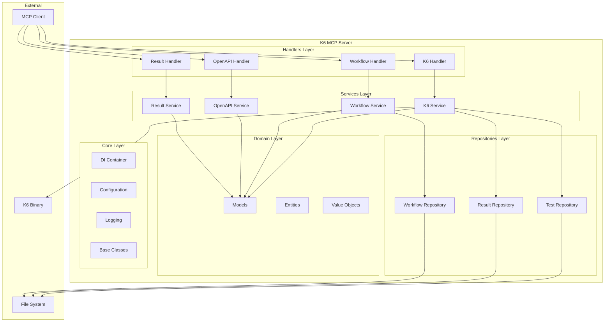
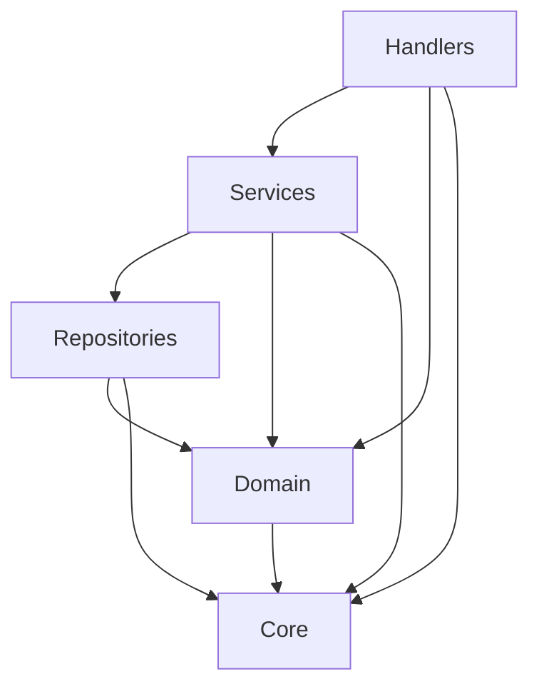
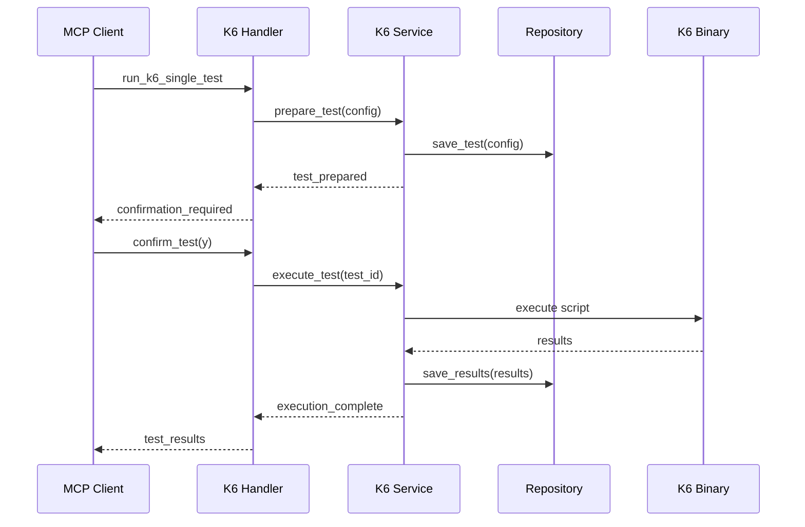
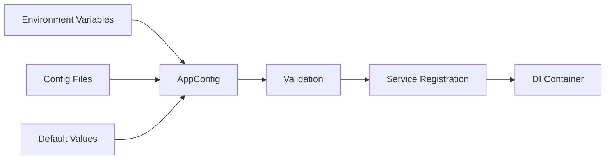
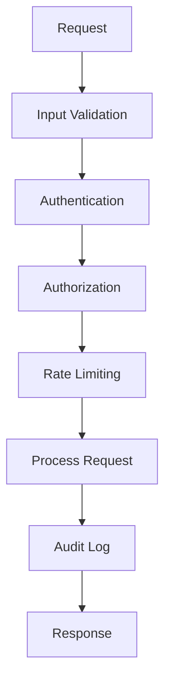

# K6 MCP Server - Architecture Documentation

## Table of Contents

1. [Overview](#overview)
2. [Architecture Principles](#architecture-principles)
3. [System Architecture](#system-architecture)
4. [Layer Details](#layer-details)
5. [Component Interactions](#component-interactions)
6. [Data Flow](#data-flow)
7. [Deployment Architecture](#deployment-architecture)
8. [Security Architecture](#security-architecture)
9. [Performance Considerations](#performance-considerations)
10. [Extensibility](#extensibility)

## Overview

The K6 MCP Server follows a **Clean Architecture** pattern with clear separation of concerns, dependency injection, and modern software engineering practices. The system is designed to be maintainable, testable, scalable, and extensible.

### Key Architectural Goals

- **Maintainability**: Easy to understand, modify, and extend
- **Testability**: Comprehensive testing at all levels
- **Scalability**: Efficient resource usage and performance
- **Reliability**: Robust error handling and fault tolerance
- **Security**: Comprehensive security measures throughout

## Architecture Principles

### 1. Clean Architecture

```
🔵 Domain (Entities)          ← Business Rules & Models
🟢 Use Cases (Services)       ← Application Business Logic  
🟡 Interface Adapters         ← Controllers, Presenters, Repositories
🔴 Frameworks & Drivers       ← Web, Database, External APIs
```

**Dependency Rule**: Dependencies only point inward. Inner layers don't depend on outer layers.

### 2. SOLID Principles

- **S**ingle Responsibility: Each class has one reason to change
- **O**pen/Closed: Open for extension, closed for modification
- **L**iskov Substitution: Derived classes must be substitutable
- **I**nterface Segregation: Clients shouldn't depend on unused interfaces
- **D**ependency Inversion: Depend on abstractions, not concretions

### 3. Design Patterns

- **Repository Pattern**: Abstract data access
- **Service Layer Pattern**: Encapsulate business logic
- **Dependency Injection**: Invert control of dependencies
- **Observer Pattern**: Event-driven architecture
- **Circuit Breaker**: Fault tolerance
- **Cache-Aside**: Performance optimization

## System Architecture

### High-Level Architecture



### Component Organization

```
┌─────────────────┐
│    Handlers     │ ← MCP Tool Interface
├─────────────────┤
│    Services     │ ← Business Logic
├─────────────────┤
│  Repositories   │ ← Data Access
├─────────────────┤
│     Domain      │ ← Business Models
├─────────────────┤
│      Core       │ ← Infrastructure
└─────────────────┘
```

## Layer Details

### 1. Core Layer

**Purpose**: Provides foundational infrastructure and cross-cutting concerns.

**Components**:
- **DI Container** (`container.py`): Manages service lifetimes and dependencies
- **Configuration** (`config.py`): Environment-aware configuration management
- **Logging** (`logging.py`): Structured logging and monitoring
- **Base Classes** (`base.py`): Common abstractions and patterns

**Responsibilities**:
- Dependency injection and service registration
- Configuration loading and validation
- Logging infrastructure and metrics collection
- Common base classes and utilities

### 2. Domain Layer

**Purpose**: Contains business entities, value objects, and domain logic.

**Components**:
- **Models** (`models.py`): Domain entities and business rules
- **Value Objects**: Immutable objects representing domain concepts
- **Domain Services**: Domain-specific logic

**Key Models**:
```python
# Test Configuration
class K6TestConfig(BaseModel):
    url: str
    method: HttpMethod
    virtual_users: int
    duration: Optional[str]
    # ... validation rules

# Test Result
class K6TestResult(BaseModel):
    test_id: str
    success: bool
    metrics: TestMetrics
    # ... business logic
```

### 3. Repository Layer

**Purpose**: Abstracts data access and provides persistence operations.

**Pattern**: Repository Pattern with CRUD operations

**Repositories**:

```python
class TestRepository(BaseRepository[K6TestConfig]):
    async def get_by_id(self, id: str) -> Optional[K6TestConfig]
    async def create(self, entity: K6TestConfig) -> OperationResult[K6TestConfig]
    async def update(self, id: str, entity: K6TestConfig) -> OperationResult[K6TestConfig]
    async def delete(self, id: str) -> OperationResult[bool]
```

**Features**:
- Generic CRUD operations
- Caching support
- Data retention policies
- Search and filtering

### 4. Services Layer

**Purpose**: Implements application business logic and orchestrates operations.

**Services**:

```python
class K6TestService(BaseService):
    async def prepare_test(self, config: K6TestConfig) -> OperationResult[str]
    async def execute_test(self, test_id: str) -> OperationResult[K6TestResult]
    async def get_test_status(self, test_id: str) -> OperationResult[TestStatus]
```

**Responsibilities**:
- Business logic implementation
- Transaction management
- Service coordination
- Error handling and validation

### 5. Handlers Layer

**Purpose**: Handles MCP protocol requests and coordinates with services.

**Handlers**:

```python
class K6TestHandler(BaseHandler):
    async def handle(self, name: str, arguments: Dict[str, Any]) -> Dict[str, Any]
```

**Responsibilities**:
- MCP protocol handling
- Request validation
- Response formatting
- Error translation

## Component Interactions

### Dependency Flow



### Service Dependencies

```python
# Dependency injection configuration
container.register_singleton(AppConfig, config)
container.register_singleton(TestRepository)
container.register_singleton(K6TestService)  # Depends on TestRepository
container.register_singleton(K6TestHandler)  # Depends on K6TestService
```

### Request Flow

1. **MCP Client** sends tool request
2. **Handler** validates request and extracts parameters
3. **Service** implements business logic
4. **Repository** handles data persistence
5. **Domain Models** enforce business rules
6. **Core** provides cross-cutting concerns

## Data Flow

### Test Execution Flow



### Configuration Flow



## Deployment Architecture

### Single Instance Deployment

```
┌─────────────────┐
│   MCP Client    │
└─────────┬───────┘
          │ stdio
┌─────────▼───────┐
│  K6 MCP Server  │
├─────────────────┤
│   Config Files  │
│   Log Files     │
│   Test Results  │
└─────────┬───────┘
          │
┌─────────▼───────┐
│   K6 Binary     │
└─────────────────┘
```

### Multi-Instance Deployment

```
┌─────────────────┐
│  Load Balancer  │
└─────────┬───────┘
          │
    ┌─────▼─────┐
    │           │
┌───▼───┐   ┌───▼───┐
│Server1│   │Server2│
└───┬───┘   └───┬───┘
    │           │
┌───▼───────────▼───┐
│  Shared Storage   │
└───────────────────┘
```

## Security Architecture

### Security Layers

1. **Input Validation**: All inputs validated at entry points
2. **Authentication**: MCP protocol security
3. **Authorization**: Role-based access control
4. **Audit Logging**: Security event tracking
5. **Rate Limiting**: Protection against abuse
6. **Resource Limits**: Memory and CPU protection

### Security Flow



## Performance Considerations

### Caching Strategy

```
┌─────────────────┐
│  Application    │ ← LRU Cache (1000 items, 1h TTL)
├─────────────────┤
│  Repository     │ ← Query Cache (500 items, 30m TTL)
├─────────────────┤
│  File System    │ ← OS File Cache
└─────────────────┘
```

### Async Operations

- **Non-blocking I/O**: All I/O operations are async
- **Connection Pooling**: Efficient resource usage
- **Batch Processing**: Multiple operations combined
- **Circuit Breakers**: Fault tolerance

### Resource Management

```python
# Resource pool example
class ResourcePool:
    def __init__(self, factory: Callable, max_size: int = 10):
        self.pool = asyncio.Queue(maxsize=max_size)
        self.factory = factory
    
    async def acquire(self) -> Resource:
        # Get from pool or create new
    
    async def release(self, resource: Resource):
        # Return to pool
```

## Extensibility

### Adding New Components

1. **New Service**: Implement `BaseService`
2. **New Repository**: Implement `BaseRepository[T]`
3. **New Handler**: Implement `BaseHandler`
4. **New Model**: Extend domain models

### Plugin Architecture

```python
# Service registration
def register_custom_service(container: DIContainer):
    container.register_singleton(CustomService)
    container.register_singleton(CustomHandler)

# Usage
container = DIContainer()
register_custom_service(container)
```

### Configuration Extension

```python
@dataclass
class CustomConfig:
    custom_setting: str = "default"

@dataclass  
class ExtendedAppConfig(AppConfig):
    custom: CustomConfig = field(default_factory=CustomConfig)
```

## Monitoring and Observability

### Health Checks

```python
async def health_check() -> Dict[str, Any]:
    return {
        "status": "healthy",
        "components": [
            {"name": "k6_service", "status": "healthy"},
            {"name": "file_system", "status": "healthy"}
        ]
    }
```

### Metrics Collection

- **Performance Metrics**: Response times, throughput
- **Business Metrics**: Test execution rates, success rates
- **System Metrics**: Memory usage, CPU usage
- **Error Metrics**: Error rates, error types

### Logging Strategy

```python
# Structured logging
logger.info(
    "Test execution completed",
    event_type=LogEventType.BUSINESS,
    test_id="test_123",
    duration_ms=1250.5,
    success=True
)
```

## Best Practices

### Code Organization

- **Single Responsibility**: Each class has one purpose
- **Dependency Injection**: Use DI for all dependencies
- **Error Handling**: Comprehensive error handling
- **Testing**: Unit tests for all components

### Performance

- **Async/Await**: Use async operations
- **Caching**: Cache expensive operations
- **Resource Pooling**: Reuse expensive resources
- **Memory Management**: Monitor and optimize memory

### Security

- **Input Validation**: Validate all inputs
- **Error Sanitization**: Don't leak sensitive information
- **Audit Logging**: Log security events
- **Principle of Least Privilege**: Minimal permissions

---

This architecture provides a solid foundation for a maintainable, scalable, and reliable K6 MCP Server that can evolve with changing requirements while maintaining high code quality and performance.